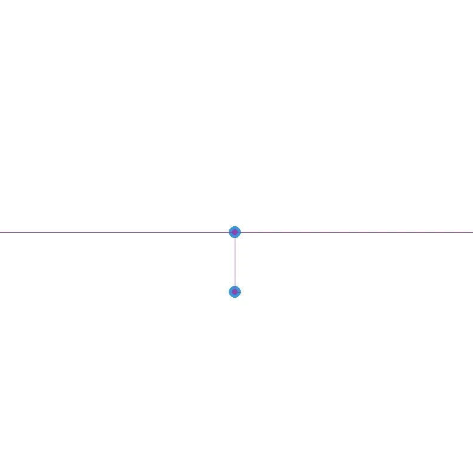

# Inverted Pendulum Balance with Reinforcement Learning

## Demo



A PyMunk physics simulation trained using Stable Baselines3 PPO to balance an inverted pendulum (cartpole system).

## Features

- Custom physics simulation using PyMunk
- Reinforcement learning with PPO algorithm
- Manual control mode for testing
- Visual rendering with Pygame
- Parallel environment training
- Reward shaping for better learning

## Requirements

- Python
- See [requirements.txt](requirements.txt) for dependencies

## Installation

```bash
pip install -r requirements.txt
```

## Usage

### Training the Model

Train the RL agent with default parameters:

```bash
python train.py
```

The model will be saved to `models/cartpole` by default.

### Testing Trained Models

View a trained model in action:

```bash
python render_model.py
```

To load a specific model:

```bash
python render_model.py models/my_custom_model
```

### Manual Control

Try balancing the pendulum yourself:

```bash
python manual.py
```

### Controls

The controls work in both manual and rendering modes.

- Press mouse and move left/right to apply force proportional to mouse position
- Left/Right arrows: Move cart
- R: Reset simulation
- W/S/A/D/Q/E: Set pendulum to specific angles
- ESC: Quit

## Reward Function

The reward combines:

- Upright position bonus (quadratic)
- Position penalty (keeps cart centered)
- Velocity penalties (angular and linear)
